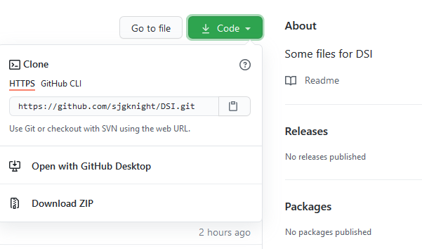
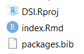
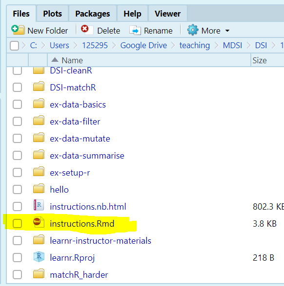

---
output:
  html_document:
    df_print: paged
    self_contained: no
---

# learnr activities

## Setting up

We're going to embed some learnr activities now. The first one is "live" on the shinyapps.io server. It will walk you through setting up and running the other later tasks.

To do this, You're going to download RStudio (if you haven't already). Follow the tutorial below to do that.

```{r basics, out.width="100%"}
#knitr::include_url("https://learnr-examples.shinyapps.io/ex-setup-r/")
knitr::include_app("https://learnr-examples.shinyapps.io/ex-setup-r/", height = "600px")

```

## Downloading the resources

### Getting the files

Ok, now we're going to download these files from github, and run something.

1.  The code for this book is available at <https://github.com/sjgknight/dsi/> You can download a set of interactive *tutorials* from <https://github.com/sjgknight/learnr> most of these were built by the great RStudio team and collaborators.

2.  There are three ways you can get the code:

    1.  **The easiest:** Go to [that repository](https://github.com/sjgknight/learnr), on the right hand side you'll see "code" - click that, and "download zip" (or, [direct link](https://github.com/sjgknight/learnr/archive/refs/heads/master.zip))

    2.  **Medium level:** You can do the same thing using `R`. Now you've got `R` installed, you can run the code below to do this.

    3.  **Git-method:** If you're using git anyway (or, going to learn in Stats, Data Science Practice, or another subject) you might like to link the project to the repo, there are instructions for that at [Happy Git and GitHub for the useR](https://happygitwithr.com/new-github-first.html).

```{r getbook}
download.file(url = "https://github.com/sjgknight/learnr/archive/refs/heads/master.zip", destfile = "dsi-learnr.zip")  #if you want the book too, you can uncomment this line

# unzip the .zip file
unzip(zipfile = "dsi-learnr.zip")

#########################################################
#download.file(url = "https://github.com/sjgknight/DSI/archive/refs/heads/main.zip", destfile = "dsi.zip")  #if you want the book too, you can uncomment this line

```

### Creating and opening projects

`RStudio` helps you manage projects. Make sure the download is unzipped in a location you want it on your machine:

1.  If you've downloaded an existing project, you might find the .Rproj file, and click that 
2.  Now you're inside a project. Projects help you organise your work. They are associated with *directories* and their subdirectories. You can create new ones under the 'File' menu.
3.  Now you've opened the project, go to the instructions Rmd, open it, and follow along from there 

```{r deploy, eval=FALSE, include=FALSE}
#This is just some notes for Simon about different ways to deploy, it isn't executed

#Learnr into a package
https://education.rstudio.com/blog/2020/09/delivering-learnr-tutorials-in-a-package/ 
recommends bundling as a package and having users download that.
learnr::run_tutorial(name = "tutorial", package = "packagename")

#To send to shinyapps.io
rsconnect::listBundleFiles("matchR/")
rsconnect::deployApp(appFiles = c("matchR/snippet_matchR_clustered.Rmd","matchR/snippet_matchR_clustered.html"), appName = "matchR", appTitle = "matchR")

rsconnect::deployApp(appDir = "matchR/")

#Anything we want to be shiny needs to have output line in yaml:
runtime: shinyrmd 

#We can run locally per above with rmarkdown::run

#You can package shinyapps as standalone for people to execute on their machines, per below
https://oddhypothesis.blogspot.com/2016/04/desktop-deployr.html
```
