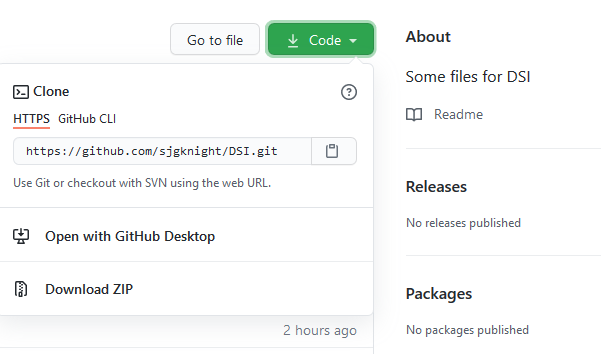
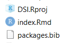

--- 
title: "36100 Data Science for Innovation materials"
author: "Simon Knight"
date: "`r Sys.Date()`"
site: bookdown::bookdown_site
output: bookdown::gitbook
documentclass: book
bibliography: [book.bib,packages.bib]
biblio-style: apalike
link-citations: true
nocite: | 
  @*
github-repo: sjgknight/dsi
description: "This is some of the materials we'll use in the class. These materials were published with the package bookdown::gitbook."
---

# Prerequisites

This is a _sample_ book written in **Markdown**. You can use anything that Pandoc's Markdown supports, e.g., a math equation $a^2 + b^2 = c^2$.

The **bookdown** package can be installed from CRAN or Github:

```{r eval=FALSE}
#install.packages("bookdown")
# or the development version
# devtools::install_github("rstudio/bookdown")
library(bookdown)
options(bookdown.render.file_scope = FALSE)

```

Remember each Rmd file contains one and only one chapter, and a chapter is defined by the first-level heading `#`.

To compile this example to PDF, you need XeLaTeX. You are recommended to install TinyTeX (which includes XeLaTeX): <https://yihui.name/tinytex/>.

## What's in here?
There are: Some vignettes (next), two sample AT2 templates, there is also a third but embedding it currently breaks things. And then references.
There are learnr packages I'll include at some point. 


## To download and use the code...
And code for the book can be found <https://github.com/sjgknight/dsi>
```{r serve}
#If you've downloaded the code for the book, you can preview it by running the line below 
#bookdown:::serve_book()
```

```{r include=FALSE}

#knitr::opts_chunk$set(cache = TRUE)
# automatically create a bib database for R packages
knitr::write_bib(c(
  .packages(), 'bookdown', 'knitr', 'rmarkdown'
), 'packages.bib')
#This passes a list of all packages loaded in the current session to write_bib, which writes the citations to "packages.bib" Notice we've separated "book.bib" from "packages.bib", so this works for packages, and you can create your book.bib manually
```


<!--chapter:end:index.Rmd-->

---
title: "R Notebook"
output:
  html_document:
    df_print: paged
---

# Preamble
The aim of this file is to show you some basic functionality of an Rmd, and some of the kinds of analysis you might do.  It's not intended to be exhaustive, it's just to stimulate ideas.  

# Some introductory functions

This is an export of an [R Markdown](http://rmarkdown.rstudio.com) Notebook. When you access the raw notebook, you can execute code within the notebook on your computer and the results appear beneath the code. 

If you have downloaded the code, you can try executing this chunk by clicking the *Run* button within the chunk or by placing your cursor inside it and pressing *Ctrl+Shift+Enter*. 

```{r gitsetup, eval=FALSE, message=FALSE, warning=FALSE, include=FALSE}
####This block won't be visible on the Rmd (it suppresses messages and warnings, and neither the code nor the output are visible.). To run it, change eval=FALSE to TRUE.  This doesn't really need to be here, but you should run gitignore when you setup new projects.

#library(gitignore)
#gi_fetch_templates("R", append_gitignore = TRUE) #you can use this function to get common gitignore templates, particularly useful if you're using other languages. By default when r creates a git repo some of these are in it anyway.

####To this you might want to add other things like api keys, maybe data, etc.  There are a range of ways to do this, for the purpose of this demo it's useful for me to create a script in a private folder that is ignored, and which creates the api keys in my environment.  To demonstrate this, we'll (1) add that folder to the gitignore, (2) create it, (3) add a file to it, you'll need to change this one (or open up the file and edit it) to add your own keys.  You can then (4) easily use 'source' to include that file to run it

#write_lines("/private/",".gitignore",sep = "\n", append = TRUE)  #step 1
#dir.create("private") #step 2
#file.create("private/keys.R") #step 3a
#write_lines(c("",""),"private/keys.R",sep = "\n", append = TRUE) #step 3b

#source("private/keys.R") #step 4
```

## First, we're going to load libraries

Normally you'd hide the code chunk below, but in this instance we'll keep it there.
```{r load-libraries, echo=TRUE, message=FALSE, warning=FALSE}
library(tidyverse)  #loads ggplot2, stringr,
                    #Installing tidyverse includes (but won't load as part of it) readxl,                       jsonlite, lubridate, httr, rvest, xml2, googlesheets4, 
library(readxl)
library(jsonlite)
library(lubridate)
library(httr)
#these are also useful (in part to demonstrate features)
library(psych)
library(doBy)
library(reshape2)
library(lattice)
library(scales)
library(tidytext)
#SimComp lets me create some random datasets with defined properties
library(SimComp)  
#The ones below are specifically for this data
library(dslabs)
library(trackeR)
library(trackeRapp)
#library(maptools)
#library(revgeo)
#So I can embed webpages
#install.packages("webshot")
#webshot::install_phantomjs()
library(webshot)
library(htmlwidgets)
library(widgetframe)
```

Add a new chunk by clicking the *Insert Chunk* button on the toolbar or by pressing *Ctrl+Alt+I*.

When you save the notebook, an HTML file containing the code and output will be saved alongside it (click the *Preview* button or press *Ctrl+Shift+K* to preview the HTML file).

The preview shows you a rendered HTML copy of the contents of the editor. Consequently, unlike *Knit*, *Preview* does not run any R code chunks. Instead, the output of the chunk when it was last run in the editor is displayed.

# Examples of analysing data in R

These are some example vignettes - worked examples - of how to run a set of analyses in R.  You might find some of them useful.  You can also explore the examples https://quantifiedself.com/show-and-tell/ and various other sources!

Remember, there is no expectation that you code in DSI 36100.  There are many many freely available tools that will help you run the kind of basic exploratory statistical analyses you need for AT2 (e.g. spreadsheet tools), and visualise data.

There are also free tools that will analyse text and images (although possibly not in batch, unless you use an app to collect the images), again without coding. The key thing for this assignment is thinking creatively about how to analyse and make sense of the data and the justification for that, not demonstrating advanced coding skills.

Most of the examples below are from MDSI students (a couple from me, and a few externals).

## Useful other tools or snippets of code

You might also find these few posts useful:

* An Introduction to Accessing RESTful APIs Using R, by Werner Schott, March 31, 2019: In the past, working in R has meant importing data into the application from numerous sources. I have found this very manual and not very reproducible in the development of applications. One of the weaknesses I have identified and would like to address is to understand how to access online data resources using the appropriate packages in R. The scope of this exercise is not to master the use of one package or several packages, but rather understand how certain R packages fit into the overall process, and what that process is. http://rpubs.com/plantagenet/481658  
* Use R-Studio on any PC (with portable apps), Joshua McCarthy, 29 March 2019, Someone out there has kindly adapted R to the Portable Apps framework! This means we can use R and R-Studio anywhere we like without needing to install R and R-Studio locally, quite handy for work, University computers and VM’s. We can also keep all our libraries and packages in one location making them easier to manage when moving between workstations. http://rpubs.com/jsmccid/rportable 
* https://github.com/thomasp85/gganimate  - this is very cool, create animated gif visualisations http://r-statistics.co/Top50-Ggplot2-Visualizations-MasterList-R-Code.html - nice examples of a bunch of ggplot charts
* Create sonified data (using audio to represent the shape of data, as we use visualisation) http://playitbyr.org/ 
* https://cran.r-project.org/web/packages/googleway/vignettes/googleway-vignette.html - connect to a variety of google map based services
* Want to visualise your web history?  Here’s one way to do that https://www.webhistorian.org/education/ 
* Some time ago I saw a blog post on visualising your twitter history using streamgraphs in R. As my tweets moved from mostly psychology/philosophy tweeting around my teaching, through to my current mish-mash of learning analytics stuff, I thought it’d be interesting to play with this. So, here’s the code reproduced, plus my streamgraph. http://sjgknight.com/finding-knowledge/2016/01/visualising-twitter-history/ 

Remember, not all of these approaches are _good_ or _sensible_ approaches, consider how you use standard features like tables and reporting numbers, and don't go overboard with complex visualisations. 

## gganimate

```{r ggan_example, out.width = "100%"}
if(!file.exists("vignettes/gganimate.html")){
  file.copy(RShowDoc("gganimate", package = "gganimate"), "vignettes/", overwrite = FALSE)
#file.copy(vignette("gganimate"), "vignettes/", overwrite = FALSE)
}

knitr::include_url("vignettes/gganimate.html")

```


## Garmin
```{r garmin, out.width = "100%"}
#uses the library trackeR. See vignette at https://cran.r-project.org/web/packages/trackeR/vignettes/TourDetrackeR.html - read for detail
#First we're going to load some dummy data. 
#to do this with your own data, you'll need to use the function read_container
#TO DO THAT YOU SHOULD UNCOMMENT THE FOLLOWING TWO LINES
#BUT FOR THE PURPOSES OF THIS DEMO I'M JUST GOING TO IMPORT THE PACKAGE DATA
#filepath <- "private/your_Garmin_export.TCX.gz"
#runDF <- read_container(filepath, type = "tcx", timezone = "GMT") #check other options
##################################################
##################################################
#knitr::include_url("http://cran.r-project.org/web/packages/trackeR/vignettes/TourDetrackeR.html")
#Because I actually have this file locally as part of the package I'm going to save a copy into a new directory, and then display that version 

if(!file.exists("vignettes/TourDetrackeR")){
  file.copy(RShowDoc("TourDetrackeR", package = "trackeR"), "vignettes/", overwrite = FALSE) 
}

knitr::include_url("vignettes/TourDetrackeR.html")

```

## Walking data (and covid impacts)
```{r walking}
knitr::include_url("https://methodmatters.github.io/impact-covid-19-pandemic-2020-steps/")
```

## Your location
```{r location}
#This one is from this markdown https://rpubs.com/Geoff_W/481405 by Geoff, an alumnus of the MDSI

if(!file.exists("vignettes/location.html")){
  download.file("https://rstudio-pubs-static.s3.amazonaws.com/481405_ff86c5e272d84cc6a47c3d4b3c0fb0c3.html", "vignettes/location.html")
}

knitr::include_url("vignettes/location.html")

```

## Text mining demo
Show some functions basic text stuff.
```{r text mining}
knitr::include_url("https://rafalab.github.io/dsbook/text-mining.html")

if(!file.exists("vignettes/tidytext")){
  file.copy(RShowDoc("tidytext", package = "tidytext"), "vignettes/", overwrite = FALSE)
}

knitr::include_url("vignettes/tidytext.html")

#knitr::include_url("https://cran.r-project.org/web/packages/tidytext/vignettes/tidytext.html")

```

## Sentiment on text
This is a nicer sentiment analysis package
```{r sentiment}
#knitr::include_url("https://github.com/trinker/sentimentr/blob/master/README.md")


if(!file.exists("vignettes/sentimentr.html")){
  download.file("https://github.com/trinker/sentimentr/blob/master/README.md", "vignettes/sentimentr.html")
}

knitr::include_url("vignettes/sentimentr.html")

```

## Named entity recognition
Can we identify things (people, places, etc.) in text?
```{r NER}
#I dn't have storng views on whether this package is the best (the vignette could be expanded a bit...), but it is a tidy approach to NLP and has a nice entity extraction (see entity_type  and entity)
knitr::include_url("https://statsmaths.github.io/cleanNLP/state-of-union.html")

#another simple option is entity
#knitr::include_url("https://github.com/trinker/entity/blob/master/README.md")

if(!file.exists("vignettes/NER.html")){
  download.file("https://github.com/trinker/entity/blob/master/README.md", "vignettes/NER.html")
}

knitr::include_url("vignettes/NER.html")

#https://towardsdatascience.com/quick-guide-to-entity-recognition-and-geocoding-with-r-c0a915932895
#Notice they also geocode their data using https://cran.r-project.org/web/packages/tidygeocoder/vignettes/tidygeocoder.html 
```

## Image processing Images
Here's a silly example of some functions for dealing with image data, including image recognition
```{r images}
#knitr::include_url("https://rpubs.com/sjgknight/food")

knitr::include_url("vignettes/clarifai.html")

```

## EDA and Descriptive Statistics
Show some...
```{r EDA}
```

## QS_Ledger (a set of Python modules)
The repo at https://github.com/markwk/qs_ledger is a set of Python scripts to get data as below. I've included this as a `submodule` in git, in the vignettes directory.  At time of writing this included:


* Apple Health: fitness and health tracking, data analysis and dashboard from iPhone or Apple Watch (includes example of Elastic Search integration and Kibana Health Dashboard).
* AutoSleep: iOS sleep tracking data analysis of sleep per night and rolling averages.
* Fitbit: fitness and health tracking and analysis of Steps, Sleep, and Heart Rate from a Fitbit wearable.
* GoodReads: book reading tracking and data analysis for GoodReads.
* Google Calendar: past events, meetings and times for Google Calendar.
* Google Sheets: get data from any Google Sheet which can be useful for pulling data from IFTTT integrations that add data.
* Habitica: habit and task tracking with Habitica's gamified approach to task management.
* Instapaper: articles read and highlighted passages from Instapaper.
* Kindle Highlights: Parser and Highlight Extract from Kindle clippings, along with a sample data analysis and tool to export highlights to separate markdown files.
* Last.fm: music tracking and analysis of music listening history from Last.fm.
* Oura: oura ring activity, sleep and wellness data.
* RescueTime: track computer usage and analysis of computer activities and time with RescueTime.
* Pocket: articles read and read count from Pocket.
* Strava: activities downloader (runs, cycling, swimming, etc.) and analysis from Strava.
* Todoist: task tracking and analysis of todo's and tasks completed history from Todoist app.
* Toggl: time tracking and analysis of manual timelog entries from Toggl.
* WordCounter: extract wordcounter app history and visualize recent periods of word counts.

## Social media analysis
There are lots of tools for analysing social media data, including ones that do not require any coding skill. 


For facebook data two easy approaches are:
* you can extract ad data https://github.com/RitwikGA/FacebookReportingTool 
* analyse your 'likes' for personality https://applymagicsauce.com/demo 

This post [describes working with your Facebook download data in R](http://www.deeplytrivial.com/2018/06/working-with-your-facebook-data-in-r.html?m=1)

## Other fun examples
### search history
```{r search}

if(!file.exists("vignettes/search.html")){
  download.file("https://rstudio-pubs-static.s3.amazonaws.com/359000_436aec1332894fe8b4651e1aab587d12.html", "vignettes/search.html")
}

knitr::include_url("vignettes/search.html")
```


...your example here!

<!--chapter:end:01-demo.Rmd-->

---
output:
  html_document:
    df_print: paged
---

# Introduction to the AT2 Templates

For your AT2 assignment we ask you to submit your report as a *knitted* file. You **do not** have to write any `r` code to do this. At simplest, you can create all your analysis (data, visualisations) in other programs, and use `rstudio` and `markdown` to embed these, and format your document.

RStudio has made this a lot simpler recently because there is now an inbuilt visual editor (I'm using it right now and it looks almost exactly like a Word document!). Even if you use this view, you should still get familiar with the basics of `markdown`...for example, these little chunks with a grey background are introduced by using the \\\` key (top left on my keyboard) before and after the code example. To make something **bold, we use** \\\* **before and after the words,** and so on.

We've created a template to help with this.

You can download this as a Project file, either at the guthub repository <https://github.com/sjgknight/DSI-templates> or via drive <https://tinyurl.com/DSIAT2Template> (they should be in sync).


<!--chapter:end:02-templates.Rmd-->

---
output:
  html_document:
    df_print: paged
    self_contained: no
---

# learnr activities

## Setting up

We're going to embed some learnr activities now. The first one is "live" on the shinyapps.io server. It will walk you through setting up and running the other later tasks.

To do this, You're going to download RStudio (if you haven't already). Follow the tutorial below to do that.

```{r basics, out.width="100%"}
#knitr::include_url("https://learnr-examples.shinyapps.io/ex-setup-r/")
knitr::include_app("https://learnr-examples.shinyapps.io/ex-setup-r/", height = "600px")

```

## Downloading the resources

### Getting the files

Ok, now we're going to download these files from github, and run something.

1.  The code for this book is available at <https://github.com/sjgknight/dsi/> You can download a set of interactive *tutorials* from <https://github.com/sjgknight/learnr> most of these were built by the great RStudio team and collaborators.

2.  There are three ways you can get the code:

    1.  **The easiest:** Go to [that repository](https://github.com/sjgknight/learnr), on the right hand side you'll see "code" - click that, and "download zip" (or, [direct link](https://github.com/sjgknight/learnr/archive/refs/heads/master.zip))

    2.  **Medium level:** You can do the same thing using `R`. Now you've got `R` installed, you can run the code below to do this.

    3.  **Git-method:** If you're using git anyway (or, going to learn in Stats, Data Science Practice, or another subject) you might like to link the project to the repo, there are instructions for that at [Happy Git and GitHub for the useR](https://happygitwithr.com/new-github-first.html).

```{r getbook, eval=F}
download.file(url = "https://github.com/sjgknight/learnr/archive/refs/heads/master.zip", destfile = "dsi-learnr.zip")  #if you want the book too, you can uncomment this line

# unzip the .zip file
unzip(zipfile = "dsi-learnr.zip")

```

### Creating and opening projects

`RStudio` helps you manage projects. Make sure the download is unzipped in a location you want it on your machine:

1.  If you've downloaded an existing project, you might find the .Rproj file, and click that 
2.  Now you're inside a project. Projects help you organise your work. They are associated with *directories* and their subdirectories. You can create new ones under the 'File' menu.
3.  Now you've opened the project, go to the instructions Rmd, open it, and follow along from there 

```{r deploy, eval=FALSE, include=FALSE}
#This is just some notes for Simon about different ways to deploy, it isn't executed

#Learnr into a package
https://education.rstudio.com/blog/2020/09/delivering-learnr-tutorials-in-a-package/ 
recommends bundling as a package and having users download that.
learnr::run_tutorial(name = "tutorial", package = "packagename")

#To send to shinyapps.io
rsconnect::listBundleFiles("matchR/")
rsconnect::deployApp(appFiles = c("matchR/snippet_matchR_clustered.Rmd","matchR/snippet_matchR_clustered.html"), appName = "matchR", appTitle = "matchR")

rsconnect::deployApp(appDir = "matchR/")

#Anything we want to be shiny needs to have output line in yaml:
runtime: shinyrmd 

#We can run locally per above with rmarkdown::run

#You can package shinyapps as standalone for people to execute on their machines, per below
https://oddhypothesis.blogspot.com/2016/04/desktop-deployr.html
```


<!--chapter:end:03-learnr.Rmd-->

